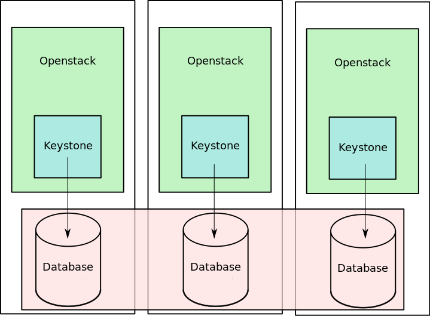

==========================================
Keystone in the context of Fog/Edge Massively Distributed Clouds
==========================================

:status: **draft**
:version: 1.0

:Abstract:

   This test plan aims to evaluate the impact of latency issues related to the number of regions on Keystone in the context of Fog/Edge cloud infrastructures. Keystone offers different deployment approaches, from a centralized one, to a federation, as well as a replication using database clustering. By varying the number of regions and latency between those regions, we compare the following deployments:
  -  One centralized Keystone handling requests of all regions
  -  A replicated Keystone using Galera Cluster to synchronize databases in the different regions
  -  A replicated Keystone leveraging the NewSQL CockroachDB database
  -  A federated Keystone

Test Plan
=========

Test Environment
----------------

We perform operational testing on Keystone using Rally to evaluate its behaviour on different database backends and configurations.

Preparation
^^^^^^^^^^^

This test plan is performed using Rally on Keystone. We emulate different latencies using `tc`_.

Environment description
^^^^^^^^^^^^^^^^^^^^^^^

The environment description includes hardware specification of servers,
network parameters, operation system and OpenStack deployment characteristics.

Hardware
~~~~~~~~

This section contains list of all types of hardware nodes.

+-----------+-------+----------------------------------------------------+
| Parameter | Value | Comments                                           |
+-----------+-------+----------------------------------------------------+
| model     |       | e.g. Supermicro X9SRD-F                            |
+-----------+-------+----------------------------------------------------+
| CPU       |       | e.g. 6 x Intel(R) Xeon(R) CPU E5-2620 v2 @ 2.10GHz |
+-----------+-------+----------------------------------------------------+

Network
~~~~~~~

This section contains list of interfaces and network parameters.
Since we are testing the behaviour of the databases depending on the latency, it will be detailed for every plans.

+------------------+-------+-------------------------+
| Parameter        | Value | Comments                |
+------------------+-------+-------------------------+
| card model       |       | e.g. Intel              |
+------------------+-------+-------------------------+
| driver           |       | e.g. ixgbe              |
+------------------+-------+-------------------------+
| speed            |       | e.g. 10G                |
+------------------+-------+-------------------------+

Software
~~~~~~~~

This section describes installed software.

+-------------------+--------+---------------------------+
| Parameter         | Value  | Comments                  |
+-------------------+--------+---------------------------+
| OS                |        | e.g. Ubuntu 14.04.3       |
+-------------------+--------+---------------------------+
| OpenStack release |        | Pike                      |
+-------------------+--------+---------------------------+

* Keystone DB

+-----------------+--------+---------------------------+
| Parameter       | Value  | Comments                  |
+-----------------+--------+---------------------------+
| Galera          | on/off | e.g. MariaDB 10.2         |
+-----------------+--------+---------------------------+
| CockroachDB     | on/off | e.g. CockroachDB 1.17     |
+-----------------+--------+---------------------------+

Test Case 1: One centralized Keystone handling requests of all regions
----------------------------------------------------------------------

Description
^^^^^^^^^^^

Only one Keystone is used to handle all regions and the other OpenStack systems use it.

Parameters
^^^^^^^^^^

=========================== ====================================================
Parameter name              Value
=========================== ====================================================
Number of regions           3 nodes, 25 nodes, 45 nodes
Latency between regions     0ms, 50ms, 150ms
=========================== ====================================================

List of performance metrics
^^^^^^^^^^^^^^^^^^^^^^^^^^^

Mandatory section. Defines what measurements are in fact done during the test.
To be a good citizen in case of multiple metrics collection, it will be nice to
list the metrics ordered starting with the most important one.

========  ==============  =================  =============================
Priority  Value           Measurement Units  Description
========  ==============  =================  =============================
1         Operation time  milliseconds       Time spent on each operation
========  ==============  =================  =============================

Some additional section
^^^^^^^^^^^^^^^^^^^^^^^

Depending on the test case nature, something else may need to be defined.
If so, additional sections with free form titles should be added.

Test Case 2: A replicated Keystone using Galera Cluster
-------------------------------------------------------

Description
^^^^^^^^^^^

Keystone on each regions using a Galera Cluster

Parameters
^^^^^^^^^^

=========================== ====================================================
Parameter name              Value
=========================== ====================================================
Number of regions           3 nodes, 25 nodes, 45 nodes
Latency between regions     0ms, 50ms, 150ms
=========================== ====================================================

List of performance metrics
^^^^^^^^^^^^^^^^^^^^^^^^^^^

========  ==============  =================  =============================
Priority  Value           Measurement Units  Description
========  ==============  =================  =============================
1         Operation time  milliseconds       Time spent on each operation
========  ==============  =================  =============================

Some additional section
^^^^^^^^^^^^^^^^^^^^^^^

Depending on the test case nature, something else may need to be defined.
If so, additional sections with free form titles should be added.

Test Case 3: A replicated Keystone leveraging the NewSQL CockroachDB database
-----------------------------------------------------------------------------

Description
^^^^^^^^^^^

Keystone on each regions using CockroachDB

Parameters
^^^^^^^^^^

=========================== ====================================================
Parameter name              Value
=========================== ====================================================
Number of regions           3 nodes, 25 nodes, 45 nodes
Latency between regions     0ms, 50ms, 150ms
Locality                    On/Off
=========================== ====================================================

List of performance metrics
^^^^^^^^^^^^^^^^^^^^^^^^^^^

========  ==============  =================  =============================
Priority  Value           Measurement Units  Description
========  ==============  =================  =============================
1         Operation time  milliseconds       Time spent on each operation
========  ==============  =================  =============================

Some additional section
^^^^^^^^^^^^^^^^^^^^^^^

Depending on the test case nature, something else may need to be defined.
If so, additional sections with free form titles should be added.

Test Case 4: A federated Keystone
---------------------------------

Description
^^^^^^^^^^^

Using MariaDB as Keystone database

Parameters
^^^^^^^^^^

=========================== ====================================================
Parameter name              Value
=========================== ====================================================
Number of regions           3 nodes, 25 nodes, 45 nodes
Latency between regions     0ms, 50ms, 150ms
Locality                    On/Off
=========================== ====================================================

List of performance metrics
^^^^^^^^^^^^^^^^^^^^^^^^^^^

========  ==============  =================  =============================
Priority  Value           Measurement Units  Description
========  ==============  =================  =============================
1         Operation time  milliseconds       Time spent on each operation
========  ==============  =================  =============================

Some additional section
^^^^^^^^^^^^^^^^^^^^^^^

Depending on the test case nature, something else may need to be defined.
If so, additional sections with free form titles should be added.

Some additional section
-----------------------

If there are common details for all test cases, that need to be covered
separately, they can be encapsulated in additional free form sections.

Upper level additional section
==============================

If there are additional notes, small pieces of code and configurations, etc.,
they can be defined in additional paragraphs. Huge pieces and large chunks of
configs should be stored in separated files.

.. references:
.. _tc: http://www.tldp.org/HOWTO/html_single/Traffic-Control-HOWTO/
